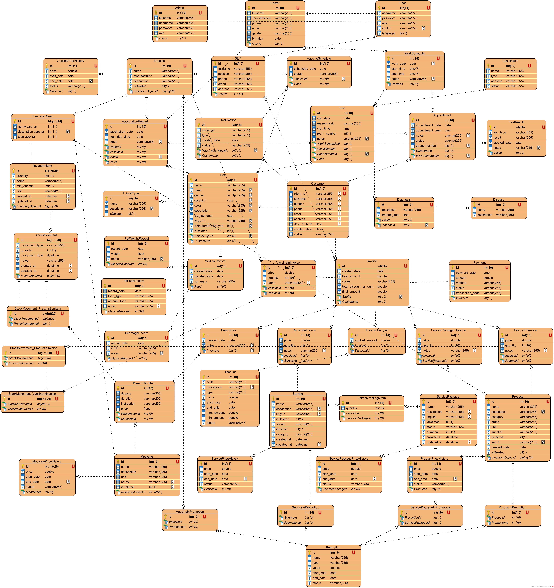
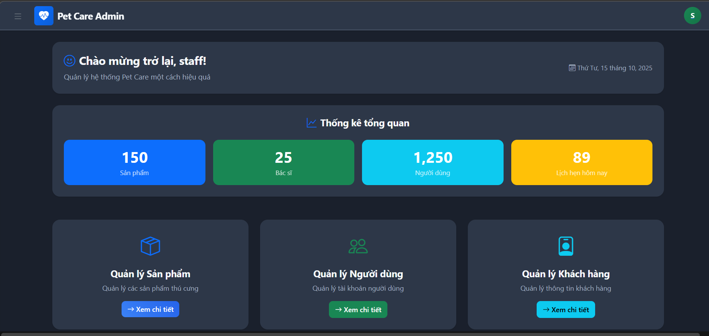
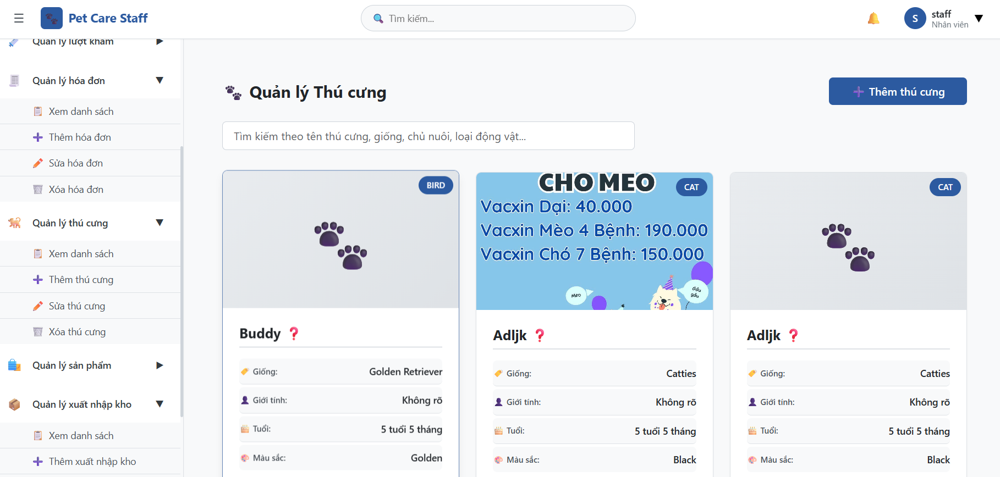

#Pet Care Backend System

## Giới thiệu dự án

**Pet Care Backend** là một hệ thống quản lý phòng khám thú y toàn diện được xây dựng bằng **Spring Boot 3.5.5** và **Java 21**. Hệ thống cung cấp các API RESTful để quản lý toàn bộ quy trình hoạt động của một phòng khám thú y, từ việc đặt lịch hẹn, quản lý thông tin thú cưng, chẩn đoán bệnh, kê đơn thuốc, đến thanh toán và báo cáo thống kê.

### Mục tiêu dự án
- Số hóa quy trình quản lý phòng khám thú y
- Tối ưu hóa trải nghiệm khách hàng và bác sĩ thú y
- Quản lý hiệu quả thông tin y tế thú cưng
- Tự động hóa quy trình thanh toán và báo cáo
- Cung cấp hệ thống thống kê và phân tích dữ liệu

## Kiến trúc hệ thống

### Kiến trúc tổng quan
```
┌─────────────────┐    ┌─────────────────┐    ┌─────────────────┐
│   Frontend      │    │   Backend API   │    │    Database     │
│   (React/Vue)   │◄──►│  (Spring Boot)  │◄──►│     (MySQL)     │
└─────────────────┘    └─────────────────┘    └─────────────────┘
                              │
                              ▼
                    ┌─────────────────┐
                    │  External APIs  │
                    │ (VNPay, Cloud)  │
                    └─────────────────┘
```

### Kiến trúc phần mềm (Layered Architecture)
```
┌─────────────────────────────────────────────────────────────┐
│                    PRESENTATION LAYER                       │
│  Controllers (REST APIs) + Security + Exception Handling   │
├─────────────────────────────────────────────────────────────┤
│                     BUSINESS LAYER                          │
│     Services + DTOs + Business Logic + Validation          │
├─────────────────────────────────────────────────────────────┤
│                  PERSISTENCE LAYER                          │
│        Repositories + JPA + Database Queries               │
├─────────────────────────────────────────────────────────────┤
│                     DATABASE LAYER                          │
│              MySQL Database + Tables + Relations           │
└─────────────────────────────────────────────────────────────┘
```

### Sơ đồ kiến trúc hệ thống
<!-- TODO: Thêm ảnh sơ đồ kiến trúc tổng quan -->

[//]: # (![System Architecture]&#40;docs/images/.png&#41;)
```markdown
┌─────────────────────────────────────────────────────────┐
│                    CLIENT LAYER                         │
│  [Web App] [Mobile App] [Admin Dashboard]              │
└─────────────────────┬───────────────────────────────────┘
                      │ HTTPS/REST API
┌─────────────────────▼───────────────────────────────────┐
│                 API GATEWAY                             │
│         [Load Balancer] [Rate Limiting]                 │
└─────────────────────┬───────────────────────────────────┘
                      │
┌─────────────────────▼───────────────────────────────────┐
│              SPRING BOOT APPLICATION                    │
│  [Controllers] [Services] [Security] [Validation]      │
└─────────────────────┬───────────────────────────────────┘
                      │
┌─────────────────────▼───────────────────────────────────┐
│                DATABASE LAYER                           │
│         [MySQL] [Redis Cache] [Connection Pool]        │
└─────────────────────────────────────────────────────────┘

External Services: [VNPay] [Cloudinary] [Email Service]
```

### 🗃Sơ đồ cơ sở dữ liệu (ERD)
<!-- TODO: Thêm ảnh Entity Relationship Diagram -->


[//]: # (## Cấu trúc dự án)

[//]: # ()
[//]: # (```)

[//]: # (src/main/java/org/example/petcarebe/)

[//]: # (├── 📁 config/                 # Cấu hình ứng dụng)

[//]: # (│   ├── SecurityConfig.java    # Cấu hình bảo mật JWT)

[//]: # (│   ├── CloudinaryConfig.java  # Cấu hình upload ảnh)

[//]: # (│   └── VnpayConfig.java      # Cấu hình thanh toán VNPay)

[//]: # (├── 📁 controller/             # REST API Controllers)

[//]: # (│   ├── AppointmentController.java)

[//]: # (│   ├── CustomerController.java)

[//]: # (│   ├── DoctorController.java)

[//]: # (│   ├── PetController.java)

[//]: # (│   ├── DiagnosisController.java)

[//]: # (│   ├── TestResultController.java)

[//]: # (│   ├── InvoiceController.java)

[//]: # (│   └── ... &#40;20+ controllers&#41;)

[//]: # (├── 📁 dto/                    # Data Transfer Objects)

[//]: # (│   ├── request/               # Request DTOs)

[//]: # (│   └── response/              # Response DTOs)

[//]: # (├── 📁 model/                  # JPA Entities)

[//]: # (│   ├── User.java)

[//]: # (│   ├── Customer.java)

[//]: # (│   ├── Pet.java)

[//]: # (│   ├── Doctor.java)

[//]: # (│   ├── Appointment.java)

[//]: # (│   ├── Visit.java)

[//]: # (│   ├── Diagnosis.java)

[//]: # (│   ├── TestResult.java)

[//]: # (│   ├── Prescription.java)

[//]: # (│   ├── Invoice.java)

[//]: # (│   └── ... &#40;40+ entities&#41;)

[//]: # (├── 📁 repository/             # Data Access Layer)

[//]: # (│   └── ... &#40;40+ repositories&#41;)

[//]: # (├── 📁 service/                # Business Logic Layer)

[//]: # (│   └── ... &#40;40+ services&#41;)

[//]: # (├── 📁 security/               # JWT Authentication)

[//]: # (│   ├── JwtUtil.java)

[//]: # (│   ├── AuthController.java)

[//]: # (│   └── CustomUserDetailsService.java)

[//]: # (├── 📁 enums/                  # Enumerations)

[//]: # (│   ├── AppointmentStatus.java)

[//]: # (│   ├── InvoiceStatus.java)

[//]: # (│   ├── PaymentStatus.java)

[//]: # (│   └── StockMovementType.java)

[//]: # (└── 📁 util/                   # Utility Classes)

[//]: # (    └── VnpayUtil.java)

[//]: # (```)

## Công nghệ sử dụng

### Backend Framework
- **Spring Boot 3.5.5** - Framework chính
- **Spring Security** - Xác thực và phân quyền
- **Spring Data JPA** - ORM và database access
- **Spring Web** - REST API development
- **Spring WebSocket** - Real-time communication
- **Spring Mail** - Email service

### Database & ORM
- **MySQL 8.0+** - Cơ sở dữ liệu chính
- **Hibernate** - JPA implementation
- **HikariCP** - Connection pooling
- **JDBC** - Database connectivity

### Security & Authentication
- **JWT (JSON Web Token)** - Stateless authentication
- **BCrypt** - Password hashing
- **Role-based Access Control** - ADMIN, DOCTOR, STAFF, CUSTOMER
- **CORS** - Cross-origin resource sharing

### External Integrations
- **VNPay** - Cổng thanh toán trực tuyến Việt Nam
- **Cloudinary** - Cloud storage cho hình ảnh
- **JavaMail** - Gửi email thông báo
- **STOMP** - WebSocket messaging protocol

### API Documentation
- **Swagger/OpenAPI 3.0** - API documentation
- **SpringDoc OpenAPI** - Swagger UI integration

### Development Tools
- **Maven** - Dependency management & build tool
- **Lombok** - Reduce boilerplate code
- **Validation API** - Input validation (JSR-303)
- **Jackson** - JSON serialization/deserialization

[//]: # (- **SLF4J & Logback** - Logging framework)

### Testing
- **JUnit 5** - Unit testing framework
- **Mockito** - Mocking framework
- **Spring Boot Test** - Integration testing

## Tính năng chính

### Quản lý người dùng & Phân quyền
- **Đăng ký/Đăng nhập** với JWT authentication
- **Phân quyền 4 cấp**: ADMIN, DOCTOR, STAFF, CUSTOMER
- **Quản lý profile** và thông tin cá nhân
- **Soft delete** và khôi phục tài khoản
- **Quản lý nhân viên** (Staff Management)
- **Quản lý bác sĩ** (Doctor Management) với chuyên môn và lịch làm việc

### Quản lý thú cưng & Khách hàng
- **Đăng ký thú cưng** với thông tin chi tiết (loại, giống, tuổi, cân nặng)
- **Quản lý khách hàng** với lịch sử giao dịch
- **Theo dõi sức khỏe**: cân nặng, tiêm chủng, dinh dưỡng
- **Lịch sử y tế** (Medical Records) và hồ sơ bệnh án
- **Upload hình ảnh** thú cưng qua Cloudinary
- **Quản lý loại động vật** (Animal Types)

### Quản lý lịch hẹn & Lịch làm việc
- **Đặt lịch hẹn** trực tuyến với bác sĩ
- **Xác nhận/Hủy** lịch hẹn
- **Quản lý lịch làm việc** bác sĩ (Work Schedule)
- **Quản lý phòng khám** (Clinic Rooms)
- **Hệ thống queue** và số thứ tự
- **Trạng thái lịch hẹn**: PENDING, CONFIRMED, CANCELLED, COMPLETED

### Quản lý khám chữa bệnh
- **Tạo visit** và ghi nhận phiên khám bệnh
- **Chẩn đoán bệnh** (Diagnosis) với database bệnh
- **Quản lý bệnh** (Disease Management)
- **Kết quả xét nghiệm** (Test Results) chi tiết
- **Kê đơn thuốc** (Prescription) và theo dõi điều trị
- **Lịch sử khám bệnh** đầy đủ theo thú cưng

### Quản lý kho & Thuốc
- **Quản lý inventory** thuốc, vaccine, sản phẩm
- **Inventory Objects**: Medicine, Product, Vaccine, Equipment, Supply
- **Inventory Items**: Theo dõi số lượng tồn kho
- **Stock Movement**: Xuất nhập kho với các loại
  - IN, OUT, PURCHASE, SALE, RETURN
  - EXPIRED, LOST, ADJUSTMENT, TRANSFER
  - PRESCRIPTION, TREATMENT
- **Quản lý giá** và lịch sử giá cho:
  - Medicine Price History
  - Product Price History
  - Vaccine Price History
  - Service Price History
  - Service Package Price History
- **Cảnh báo hết hàng** và hạn sử dụng

### Quản lý tiêm chủng
- **Lịch tiêm chủng** (Vaccination Schedule)
- **Hồ sơ tiêm chủng** (Vaccination Records)
- **Quản lý vaccine** với giá và tồn kho
- **Nhắc nhở tiêm chủng** định kỳ

### Quản lý hóa đơn & Thanh toán
- **Tạo hóa đơn** (Invoice) tự động
- **Thêm dịch vụ** vào hóa đơn:
  - Services (dịch vụ đơn lẻ)
  - Service Packages (gói dịch vụ)
  - Products (sản phẩm)
  - Vaccines (vaccine)
  - Prescriptions (đơn thuốc)
- **Tính toán tự động**:
  - Tổng tiền (Total Amount)
  - Giảm giá (Discount Amount)
  - Thuế (Tax Amount)
  - Thành tiền (Final Amount)
- **Quản lý discount** và promotion
- **Tích hợp VNPay** thanh toán online
- **Trạng thái hóa đơn**: DRAFT, PENDING, PAID, CANCELLED
- **Theo dõi công nợ** và lịch sử thanh toán

### Quản lý khuyến mãi
- **Promotion Management**: Tạo và quản lý chương trình khuyến mãi
- **Discount Management**: Mã giảm giá cho hóa đơn
- **Áp dụng khuyến mãi** cho:
  - Services
  - Service Packages
  - Products
  - Vaccines
  - Medicines
- **Loại khuyến mãi**: CASH (tiền mặt) hoặc PERCENT (phần trăm)

### Hệ thống thông báo
- **WebSocket real-time notifications**
- **Thông báo cá nhân** (Private notifications)
- **Thông báo công khai** (Public notifications)
- **Đánh dấu đã đọc/chưa đọc**
- **Lịch sử thông báo**

### Gửi Email
- **Email thông báo** lịch hẹn
- **Email xác nhận** thanh toán
- **Email nhắc nhở** tiêm chủng
- **Template email** tùy chỉnh

### Báo cáo và thống kê
- **Dashboard** tổng quan
- **Thống kê doanh thu** theo thời gian
- **Báo cáo bệnh** phổ biến
- **Hiệu suất bác sĩ** và nhân viên
- **Phân tích xu hướng** khách hàng
- **Thống kê inventory** và stock movement
- **Báo cáo tài chính** chi tiết

### Quản lý hình ảnh
- **Upload ảnh** lên Cloudinary
- **Quản lý ảnh** thú cưng, sản phẩm, dịch vụ
- **Tối ưu hóa** và resize ảnh tự động

## Chi tiết các Module

### 1.Authentication & Authorization Module
**Mô tả**: Quản lý xác thực và phân quyền người dùng
- JWT token-based authentication
- 4 roles: ADMIN, DOCTOR, STAFF, CUSTOMER
- Token expiration: 30 days
- Password encryption với BCrypt
- Role-based endpoint protection

**Endpoints chính**:
- `POST /api/auth/login` - Đăng nhập
- `POST /api/auth/register` - Đăng ký
- `POST /api/auth/refresh` - Refresh token

### 2.Customer & Pet Module
**Mô tả**: Quản lý thông tin khách hàng và thú cưng
- CRUD operations cho Customer
- CRUD operations cho Pet
- Liên kết Pet với Customer
- Quản lý Animal Types (loại động vật)
- Upload ảnh thú cưng

**Entities**: Customer, Pet, AnimalType

### 3.Appointment & Scheduling Module
**Mô tả**: Quản lý lịch hẹn và lịch làm việc
- Đặt lịch hẹn với bác sĩ
- Quản lý Work Schedule của bác sĩ
- Quản lý Clinic Rooms
- Trạng thái: PENDING, CONFIRMED, CANCELLED, COMPLETED
- Tự động kiểm tra conflict lịch

**Entities**: Appointment, WorkSchedule, ClinicRoom, Doctor

### 4.Medical Management Module
**Mô tả**: Quản lý khám chữa bệnh và hồ sơ y tế
- Tạo Visit (phiên khám)
- Diagnosis (chẩn đoán) với Disease database
- Test Results (kết quả xét nghiệm)
- Medical Records (hồ sơ y tế)
- Liên kết Visit → Diagnosis → Disease

**Entities**: Visit, Diagnosis, Disease, TestResult, MedicalRecord

### 5.Prescription & Medicine Module
**Mô tả**: Quản lý đơn thuốc và thuốc
- Kê đơn thuốc (Prescription)
- Thêm thuốc vào đơn (PrescriptionItem)
- Quản lý Medicine với giá
- Medicine Price History
- Tự động trừ kho khi kê đơn

**Entities**: Prescription, PrescriptionItem, Medicine, MedicinePriceHistory

### 6.Inventory Management Module
**Mô tả**: Quản lý kho hàng toàn diện
- **Inventory Objects**: Medicine, Product, Vaccine, Equipment, Supply
- **Inventory Items**: Số lượng tồn kho theo từng object
- **Stock Movements**: Xuất nhập kho với 11 loại movement
  - IN, OUT, PURCHASE, SALE, RETURN
  - EXPIRED, LOST, ADJUSTMENT, TRANSFER
  - PRESCRIPTION, TREATMENT
- Tự động cập nhật tồn kho
- Liên kết với Invoice, Prescription

**Entities**: InventoryObject, InventoryItem, StockMovement

### 7.Vaccination Module
**Mô tả**: Quản lý tiêm chủng
- Vaccination Schedule (lịch tiêm chủng)
- Vaccination Record (hồ sơ tiêm chủng)
- Vaccine management với giá
- Vaccine Price History
- Nhắc nhở tiêm chủng định kỳ

**Entities**: VaccinationSchedule, VaccinationRecord, Vaccine, VaccinePriceHistory

### 8.Invoice & Payment Module
**Mô tả**: Quản lý hóa đơn và thanh toán
- **Invoice**: Tạo và quản lý hóa đơn
- **Invoice Items**:
  - ServiceInInvoice
  - ServicePackageInInvoice
  - ProductInInvoice
  - VaccineInInvoice
  - PrescriptionItem (qua Prescription)
- **Tính toán tự động**:
  - Total Amount = Σ(price × quantity)
  - Tax Amount = Σ(total × taxPercent)
  - Discount Amount = Σ(discounts + promotions)
  - Final Amount = Total - Discount + Tax
- **Payment**: VNPay integration
- **Trạng thái**: DRAFT, PENDING, PAID, CANCELLED

**Entities**: Invoice, Payment, ServiceInInvoice, ProductInInvoice, VaccineInInvoice, InvoiceDiscount

### 9.Promotion & Discount Module
**Mô tả**: Quản lý khuyến mãi và giảm giá
- **Promotion**: Khuyến mãi cho items
  - ServiceInPromotion
  - ProductInPromotion
  - VaccineInPromotion
  - MedicineInPromotion
- **Discount**: Mã giảm giá cho Invoice
- **Loại**: CASH (tiền mặt) hoặc PERCENT (%)
- Tự động áp dụng khi thêm vào Invoice

**Entities**: Promotion, Discount, InvoiceDiscount, *InPromotion

### 10.Service Management Module
**Mô tả**: Quản lý dịch vụ và gói dịch vụ
- Service (dịch vụ đơn lẻ)
- Service Package (gói dịch vụ)
- Service Price History
- Service Package Price History
- Quản lý giá theo thời gian

**Entities**: Service, ServicePackage, ServicePriceHistory, ServicePackagePriceHistory

### 11.Notification Module
**Mô tả**: Hệ thống thông báo real-time
- **WebSocket**: Real-time notifications
- **STOMP Protocol**: Messaging
- **Topics**:
  - `/topic/notifications` - Public notifications
  - `/queue/notifications/{userId}` - Private notifications
- **Notification Types**: INFO, WARNING, ERROR, SUCCESS
- Đánh dấu đã đọc/chưa đọc

**Entities**: Notification

### 12.Email Module
**Mô tả**: Gửi email tự động
- Email xác nhận lịch hẹn
- Email nhắc nhở tiêm chủng
- Email thông báo thanh toán
- Template email tùy chỉnh
- JavaMail integration

### 13.Statistics & Reports Module
**Mô tả**: Báo cáo và thống kê
- Thống kê doanh thu theo thời gian
- Thống kê lịch hẹn
- Thống kê khách hàng
- Báo cáo bệnh phổ biến
- Phân tích xu hướng

### Screenshots
<!-- TODO: Thêm ảnh chụp màn hình các tính năng chính -->

#### Dashboard Admin


#### Quản lý thú cưng


#### Lịch hẹn khám


#### Kết quả xét nghiệm


## Bảo mật

### Authentication & Authorization
- **JWT Token** với thời gian hết hạn 30 ngày
- **Role-based permissions** cho từng endpoint
- **Password encryption** với BCrypt
- **CORS configuration** cho cross-origin requests

### API Security
- **Input validation** với Bean Validation
- **SQL Injection prevention** với JPA
- **XSS protection** với proper encoding
- **Rate limiting** và request throttling

[//]: # (## 📡 API Documentation)

[//]: # ()
[//]: # (### Base URL)

[//]: # (```)

[//]: # (http://localhost:8080/api)

[//]: # (```)

[//]: # ()
[//]: # (### Authentication)

[//]: # (```http)

[//]: # (POST /auth/login)

[//]: # (Content-Type: application/json)

[//]: # ()
[//]: # ({)

[//]: # (  "username": "admin",)

[//]: # (  "password": "password")

[//]: # (})

[//]: # (```)

[//]: # ()
[//]: # (### Main API Endpoints)

[//]: # ()
[//]: # (#### 👤 User & Customer Management)

[//]: # (**User APIs** &#40;`/api/public/users`&#41;)

[//]: # (- `POST /api/public/users` - Tạo tài khoản người dùng)

[//]: # (- `GET /api/public/users` - Lấy danh sách người dùng)

[//]: # (- `PUT /api/public/users/{id}` - Cập nhật thông tin người dùng)

[//]: # (- `DELETE /api/public/users/{id}` - Xóa người dùng &#40;soft delete&#41;)

[//]: # ()
[//]: # (**Customer APIs** &#40;`/api/user/v1/customers`&#41;)

[//]: # (- `POST /api/user/v1/customers` - Tạo khách hàng)

[//]: # (- `GET /api/user/v1/customers` - Lấy danh sách khách hàng)

[//]: # (- `GET /api/user/v1/customers/{id}` - Chi tiết khách hàng)

[//]: # (- `PUT /api/user/v1/customers/{id}` - Cập nhật khách hàng)

[//]: # (- `GET /api/user/v1/customers/{id}/pets` - Danh sách thú cưng của khách hàng)

[//]: # (- `GET /api/user/v1/customers/{id}/appointments` - Lịch hẹn của khách hàng)

[//]: # (- `GET /api/user/v1/customers/{id}/invoices` - Hóa đơn của khách hàng)

[//]: # ()
[//]: # (#### 🐾 Pet Management)

[//]: # (**Pet APIs** &#40;`/api/user/v1/pets`&#41;)

[//]: # (- `POST /api/user/v1/pets` - Đăng ký thú cưng)

[//]: # (- `GET /api/user/v1/pets/{id}` - Thông tin thú cưng)

[//]: # (- `PUT /api/user/v1/pets/{id}` - Cập nhật thông tin thú cưng)

[//]: # (- `DELETE /api/user/v1/pets/{id}` - Xóa thú cưng)

[//]: # (- `GET /api/user/v1/pets/customer/{customerId}` - Thú cưng theo khách hàng)

[//]: # ()
[//]: # (**Animal Type APIs** &#40;`/api/user/v1/animal-types`&#41;)

[//]: # (- `POST /api/user/v1/animal-types` - Tạo loại động vật)

[//]: # (- `GET /api/user/v1/animal-types` - Danh sách loại động vật)

[//]: # ()
[//]: # (#### 📅 Appointment & Schedule Management)

[//]: # (**Appointment APIs** &#40;`/api/user/v1/appointments`&#41;)

[//]: # (- `POST /api/user/v1/appointments` - Đặt lịch hẹn)

[//]: # (- `GET /api/user/v1/appointments` - Danh sách lịch hẹn)

[//]: # (- `GET /api/user/v1/appointments/{id}` - Chi tiết lịch hẹn)

[//]: # (- `PUT /api/user/v1/appointments/{id}` - Cập nhật lịch hẹn)

[//]: # (- `PUT /api/user/v1/appointments/{id}/confirm` - Xác nhận lịch hẹn)

[//]: # (- `PUT /api/user/v1/appointments/{id}/cancel` - Hủy lịch hẹn)

[//]: # (- `GET /api/user/v1/appointments/customer/{customerId}` - Lịch hẹn theo khách hàng)

[//]: # ()
[//]: # (**Work Schedule APIs** &#40;`/api/admin/v1/work-schedules`&#41;)

[//]: # (- `POST /api/admin/v1/work-schedules` - Tạo lịch làm việc bác sĩ)

[//]: # (- `GET /api/admin/v1/work-schedules` - Danh sách lịch làm việc)

[//]: # (- `GET /api/admin/v1/work-schedules/doctor/{doctorId}` - Lịch làm việc theo bác sĩ)

[//]: # ()
[//]: # (**Clinic Room APIs** &#40;`/api/admin/v1/clinic-rooms`&#41;)

[//]: # (- `POST /api/admin/v1/clinic-rooms` - Tạo phòng khám)

[//]: # (- `GET /api/admin/v1/clinic-rooms` - Danh sách phòng khám)

[//]: # ()
[//]: # (#### 🏥 Medical Management)

[//]: # (**Visit APIs** &#40;`/api/user/v1/visits`, `/api/admin/v1/visits`&#41;)

[//]: # (- `POST /api/admin/v1/visits` - Tạo visit khám bệnh)

[//]: # (- `GET /api/user/v1/visits/{id}` - Chi tiết visit)

[//]: # (- `GET /api/admin/v1/visits` - Danh sách visits)

[//]: # (- `PUT /api/admin/v1/visits/{id}` - Cập nhật visit)

[//]: # ()
[//]: # (**Diagnosis APIs** &#40;`/api/admin/v1/diagnoses`&#41;)

[//]: # (- `POST /api/admin/v1/diagnoses` - Tạo chẩn đoán)

[//]: # (- `GET /api/admin/v1/diagnoses/{id}` - Chi tiết chẩn đoán)

[//]: # (- `GET /api/admin/v1/diagnoses/visit/{visitId}` - Chẩn đoán theo visit)

[//]: # ()
[//]: # (**Disease APIs** &#40;`/api/user/v1/diseases`&#41;)

[//]: # (- `POST /api/user/v1/diseases` - Tạo bệnh)

[//]: # (- `GET /api/user/v1/diseases` - Danh sách bệnh)

[//]: # (- `GET /api/user/v1/diseases/{id}` - Chi tiết bệnh)

[//]: # ()
[//]: # (**Test Result APIs** &#40;`/api/admin/v1/test-results`&#41;)

[//]: # (- `POST /api/admin/v1/test-results` - Tạo kết quả xét nghiệm)

[//]: # (- `GET /api/admin/v1/test-results/{id}` - Chi tiết kết quả)

[//]: # (- `GET /api/admin/v1/test-results/visit/{visitId}` - Kết quả theo visit)

[//]: # ()
[//]: # (**Prescription APIs** &#40;`/api/admin/v1/prescriptions`&#41;)

[//]: # (- `POST /api/admin/v1/prescriptions` - Kê đơn thuốc)

[//]: # (- `GET /api/admin/v1/prescriptions/{id}` - Chi tiết đơn thuốc)

[//]: # (- `PUT /api/admin/v1/prescriptions/{id}` - Cập nhật đơn thuốc)

[//]: # (- `POST /api/admin/v1/prescriptions/{id}/items` - Thêm thuốc vào đơn)

[//]: # ()
[//]: # (**Medical Record APIs** &#40;`/api/user/v1/medical-records`&#41;)

[//]: # (- `GET /api/user/v1/medical-records/pet/{petId}` - Hồ sơ y tế theo thú cưng)

[//]: # ()
[//]: # (#### 💊 Inventory & Medicine Management)

[//]: # (**Medicine APIs** &#40;`/api/user/v1/medicines`&#41;)

[//]: # (- `POST /api/user/v1/medicines` - Tạo thuốc)

[//]: # (- `GET /api/user/v1/medicines` - Danh sách thuốc)

[//]: # (- `GET /api/user/v1/medicines/{id}` - Chi tiết thuốc)

[//]: # (- `PUT /api/user/v1/medicines/{id}` - Cập nhật thuốc)

[//]: # ()
[//]: # (**Product APIs** &#40;`/api/user/v1/products`&#41;)

[//]: # (- `POST /api/user/v1/products` - Tạo sản phẩm)

[//]: # (- `GET /api/user/v1/products` - Danh sách sản phẩm)

[//]: # (- `GET /api/user/v1/products/{id}` - Chi tiết sản phẩm)

[//]: # ()
[//]: # (**Vaccine APIs** &#40;`/api/user/v1/vaccines`&#41;)

[//]: # (- `POST /api/user/v1/vaccines` - Tạo vaccine)

[//]: # (- `GET /api/user/v1/vaccines` - Danh sách vaccine)

[//]: # (- `GET /api/user/v1/vaccines/{id}` - Chi tiết vaccine)

[//]: # ()
[//]: # (**Inventory Object APIs** &#40;`/api/admin/v1/inventory-objects`&#41;)

[//]: # (- `POST /api/admin/v1/inventory-objects` - Tạo inventory object)

[//]: # (- `GET /api/admin/v1/inventory-objects` - Danh sách inventory objects)

[//]: # ()
[//]: # (**Inventory Item APIs** &#40;`/api/admin/v1/inventory-items`&#41;)

[//]: # (- `POST /api/admin/v1/inventory-items` - Tạo inventory item)

[//]: # (- `GET /api/admin/v1/inventory-items` - Danh sách inventory items)

[//]: # (- `PUT /api/admin/v1/inventory-items/{id}` - Cập nhật số lượng)

[//]: # ()
[//]: # (**Stock Movement APIs** &#40;`/api/admin/v1/stock-movements`&#41;)

[//]: # (- `POST /api/admin/v1/stock-movements` - Tạo phiếu xuất/nhập kho)

[//]: # (- `GET /api/admin/v1/stock-movements` - Lịch sử xuất nhập kho)

[//]: # (- `GET /api/admin/v1/stock-movements/inventory/{inventoryItemId}` - Lịch sử theo item)

[//]: # ()
[//]: # (#### 💉 Vaccination Management)

[//]: # (**Vaccination Schedule APIs** &#40;`/api/admin/v1/vaccination-schedules`&#41;)

[//]: # (- `POST /api/admin/v1/vaccination-schedules` - Tạo lịch tiêm chủng)

[//]: # (- `GET /api/admin/v1/vaccination-schedules` - Danh sách lịch tiêm)

[//]: # ()
[//]: # (**Vaccination Record APIs** &#40;`/api/admin/v1/vaccination-records`&#41;)

[//]: # (- `POST /api/admin/v1/vaccination-records` - Ghi nhận tiêm chủng)

[//]: # (- `GET /api/admin/v1/vaccination-records/pet/{petId}` - Hồ sơ tiêm chủng)

[//]: # ()
[//]: # (#### 💰 Invoice & Payment Management)

[//]: # (**Invoice APIs** &#40;`/api/admin/v1/invoices`&#41;)

[//]: # (- `POST /api/admin/v1/invoices` - Tạo hóa đơn)

[//]: # (- `GET /api/admin/v1/invoices` - Danh sách hóa đơn)

[//]: # (- `GET /api/admin/v1/invoices/{id}` - Chi tiết hóa đơn)

[//]: # (- `PUT /api/admin/v1/invoices/{id}` - Cập nhật hóa đơn)

[//]: # (- `PUT /api/admin/v1/invoices/{id}/status` - Cập nhật trạng thái)

[//]: # (- `DELETE /api/admin/v1/invoices/{id}` - Hủy hóa đơn)

[//]: # (- `GET /api/admin/v1/invoices/customer/{customerId}` - Hóa đơn theo khách hàng)

[//]: # (- `GET /api/admin/v1/invoices/{id}/items` - Chi tiết items trong hóa đơn)

[//]: # (- `POST /api/admin/v1/invoices/{id}/services` - Thêm dịch vụ vào hóa đơn)

[//]: # (- `POST /api/admin/v1/invoices/{id}/service-packages` - Thêm gói dịch vụ)

[//]: # (- `POST /api/admin/v1/invoices/{id}/products` - Thêm sản phẩm)

[//]: # (- `POST /api/admin/v1/invoices/{id}/vaccines` - Thêm vaccine)

[//]: # (- `POST /api/admin/v1/invoices/{id}/prescriptions` - Thêm đơn thuốc)

[//]: # (- `POST /api/admin/v1/invoices/{id}/discounts` - Thêm discount)

[//]: # (- `GET /api/admin/v1/invoices/{id}/check-price` - Tính toán giá hóa đơn)

[//]: # ()
[//]: # (**Payment APIs** &#40;`/api/user/v1/payments`&#41;)

[//]: # (- `POST /api/user/v1/payments` - Tạo thanh toán)

[//]: # (- `POST /api/user/v1/payments/vnpay` - Thanh toán VNPay)

[//]: # (- `GET /api/user/v1/payments/vnpay/callback` - VNPay callback)

[//]: # (- `GET /api/user/v1/payments/{id}` - Chi tiết thanh toán)

[//]: # ()
[//]: # (#### 🎁 Promotion & Discount Management)

[//]: # (**Promotion APIs** &#40;`/api/admin/v1/promotions`, `/api/user/v1/promotions`&#41;)

[//]: # (- `POST /api/admin/v1/promotions` - Tạo khuyến mãi)

[//]: # (- `GET /api/user/v1/promotions` - Danh sách khuyến mãi)

[//]: # (- `GET /api/user/v1/promotions/{id}` - Chi tiết khuyến mãi)

[//]: # (- `PUT /api/admin/v1/promotions/{id}` - Cập nhật khuyến mãi)

[//]: # ()
[//]: # (**Discount APIs** &#40;`/api/admin/v1/discounts`&#41;)

[//]: # (- `POST /api/admin/v1/discounts` - Tạo mã giảm giá)

[//]: # (- `GET /api/admin/v1/discounts` - Danh sách discount)

[//]: # (- `GET /api/admin/v1/discounts/{id}` - Chi tiết discount)

[//]: # ()
[//]: # (#### 🏢 Service Management)

[//]: # (**Service APIs** &#40;`/api/user/v1/services`&#41;)

[//]: # (- `POST /api/user/v1/services` - Tạo dịch vụ)

[//]: # (- `GET /api/user/v1/services` - Danh sách dịch vụ)

[//]: # (- `GET /api/user/v1/services/{id}` - Chi tiết dịch vụ)

[//]: # ()
[//]: # (**Service Package APIs** &#40;`/api/user/v1/service-packages`&#41;)

[//]: # (- `POST /api/user/v1/service-packages` - Tạo gói dịch vụ)

[//]: # (- `GET /api/user/v1/service-packages` - Danh sách gói dịch vụ)

[//]: # (- `GET /api/user/v1/service-packages/{id}` - Chi tiết gói dịch vụ)

[//]: # ()
[//]: # (#### 💵 Price History Management)

[//]: # (**Service Price History** &#40;`/api/admin/v1/service-price-histories`&#41;)

[//]: # (- `POST /api/admin/v1/service-price-histories` - Tạo lịch sử giá dịch vụ)

[//]: # (- `GET /api/admin/v1/service-price-histories/service/{serviceId}` - Lịch sử giá)

[//]: # ()
[//]: # (**Product Price History** &#40;`/api/admin/v1/product-price-histories`&#41;)

[//]: # (- `POST /api/admin/v1/product-price-histories` - Tạo lịch sử giá sản phẩm)

[//]: # ()
[//]: # (**Medicine Price History** &#40;`/api/admin/v1/medicine-price-histories`&#41;)

[//]: # (- `POST /api/admin/v1/medicine-price-histories` - Tạo lịch sử giá thuốc)

[//]: # ()
[//]: # (**Vaccine Price History** &#40;`/api/admin/v1/vaccine-price-histories`&#41;)

[//]: # (- `POST /api/admin/v1/vaccine-price-histories` - Tạo lịch sử giá vaccine)

[//]: # ()
[//]: # (#### 👨‍⚕️ Staff & Doctor Management)

[//]: # (**Doctor APIs** &#40;`/api/admin/v1/doctors`&#41;)

[//]: # (- `POST /api/admin/v1/doctors` - Tạo bác sĩ)

[//]: # (- `GET /api/admin/v1/doctors` - Danh sách bác sĩ)

[//]: # (- `GET /api/admin/v1/doctors/{id}` - Chi tiết bác sĩ)

[//]: # ()
[//]: # (**Staff APIs** &#40;`/api/admin/v1/staffs`&#41;)

[//]: # (- `POST /api/admin/v1/staffs` - Tạo nhân viên)

[//]: # (- `GET /api/user/v1/staffs` - Danh sách nhân viên)

[//]: # ()
[//]: # (#### 🔔 Notification Management)

[//]: # (**Notification APIs** &#40;`/api/user/v1/notifications`&#41;)

[//]: # (- `GET /api/user/v1/notifications/user/{userId}` - Thông báo theo user)

[//]: # (- `PUT /api/user/v1/notifications/{id}/read` - Đánh dấu đã đọc)

[//]: # (- `GET /api/user/v1/notifications/user/{userId}/unread` - Thông báo chưa đọc)

[//]: # ()
[//]: # (**WebSocket Endpoints**)

[//]: # (- `/ws` - WebSocket connection endpoint)

[//]: # (- `/topic/notifications` - Public notifications)

[//]: # (- `/queue/notifications/{userId}` - Private notifications)

[//]: # ()
[//]: # (#### 📧 Email Management)

[//]: # (**Email APIs** &#40;`/api/admin/v1/emails`&#41;)

[//]: # (- `POST /api/admin/v1/emails/send` - Gửi email)

[//]: # (- `POST /api/admin/v1/emails/appointment-confirmation` - Email xác nhận lịch hẹn)

[//]: # ()
[//]: # (#### 🖼️ Image Upload)

[//]: # (**Image APIs** &#40;`/api/user/v1/images`&#41;)

[//]: # (- `POST /api/user/v1/images/upload` - Upload ảnh lên Cloudinary)

[//]: # (- `DELETE /api/user/v1/images/{publicId}` - Xóa ảnh)

[//]: # ()
[//]: # (#### 📊 Statistics & Reports)

[//]: # (**Statistics APIs** &#40;`/api/admin/v1/statistics`&#41;)

[//]: # (- `GET /api/admin/v1/statistics/revenue` - Thống kê doanh thu)

[//]: # (- `GET /api/admin/v1/statistics/appointments` - Thống kê lịch hẹn)

[//]: # (- `GET /api/admin/v1/statistics/customers` - Thống kê khách hàng)

[//]: # (- `GET /api/admin/v1/statistics/diseases` - Thống kê bệnh phổ biến)

[//]: # ()
[//]: # (### Response Format)

[//]: # (```json)

[//]: # ({)

[//]: # (  "id": 1,)

[//]: # (  "name": "Buddy",)

[//]: # (  "breed": "Golden Retriever",)

[//]: # (  "age": 3,)

[//]: # (  "customerName": "John Doe",)

[//]: # (  "message": "Pet created successfully")

[//]: # (})

[//]: # (```)

[//]: # ()
[//]: # (## 🔄 Workflow & Use Cases)

[//]: # ()
[//]: # (### Use Case 1: Đặt lịch hẹn và khám bệnh)

[//]: # (```)

[//]: # (1. Customer đăng ký tài khoản → POST /api/public/users)

[//]: # (2. Customer tạo thông tin cá nhân → POST /api/user/v1/customers)

[//]: # (3. Customer đăng ký thú cưng → POST /api/user/v1/pets)

[//]: # (4. Customer đặt lịch hẹn → POST /api/user/v1/appointments)

[//]: # (5. Staff xác nhận lịch hẹn → PUT /api/user/v1/appointments/{id}/confirm)

[//]: # (6. Doctor tạo Visit → POST /api/admin/v1/visits)

[//]: # (7. Doctor chẩn đoán → POST /api/admin/v1/diagnoses)

[//]: # (8. Doctor kê đơn thuốc → POST /api/admin/v1/prescriptions)

[//]: # (9. System tự động trừ kho thuốc → StockMovement &#40;PRESCRIPTION&#41;)

[//]: # (```)

[//]: # ()
[//]: # (### Use Case 2: Tạo hóa đơn và thanh toán)

[//]: # (```)

[//]: # (1. Staff tạo hóa đơn → POST /api/admin/v1/invoices)

[//]: # (2. Staff thêm dịch vụ → POST /api/admin/v1/invoices/{id}/services)

[//]: # (3. Staff thêm sản phẩm → POST /api/admin/v1/invoices/{id}/products)

[//]: # (4. Staff thêm đơn thuốc → POST /api/admin/v1/invoices/{id}/prescriptions)

[//]: # (5. Staff thêm discount → POST /api/admin/v1/invoices/{id}/discounts)

[//]: # (6. System tính toán giá → GET /api/admin/v1/invoices/{id}/check-price)

[//]: # (7. Customer thanh toán VNPay → POST /api/user/v1/payments/vnpay)

[//]: # (8. VNPay callback → GET /api/user/v1/payments/vnpay/callback)

[//]: # (9. System cập nhật trạng thái → Invoice.status = PAID)

[//]: # (10. System tạo StockMovement → SALE cho products/vaccines)

[//]: # (```)

[//]: # ()
[//]: # (### Use Case 3: Quản lý kho)

[//]: # (```)

[//]: # (1. Admin tạo Inventory Object → POST /api/admin/v1/inventory-objects)

[//]: # (2. Admin tạo Inventory Item → POST /api/admin/v1/inventory-items)

[//]: # (3. Admin nhập kho → POST /api/admin/v1/stock-movements &#40;type: PURCHASE&#41;)

[//]: # (4. System tự động cập nhật số lượng → InventoryItem.quantity += amount)

[//]: # (5. Khi bán hàng → StockMovement &#40;type: SALE&#41;)

[//]: # (6. System tự động trừ kho → InventoryItem.quantity -= amount)

[//]: # (7. Xem lịch sử → GET /api/admin/v1/stock-movements)

[//]: # (```)

[//]: # ()
[//]: # (### Use Case 4: Tiêm chủng)

[//]: # (```)

[//]: # (1. Doctor tạo lịch tiêm chủng → POST /api/admin/v1/vaccination-schedules)

[//]: # (2. System gửi email nhắc nhở → Email Service)

[//]: # (3. Customer đặt lịch hẹn tiêm → POST /api/user/v1/appointments)

[//]: # (4. Doctor ghi nhận tiêm chủng → POST /api/admin/v1/vaccination-records)

[//]: # (5. System trừ kho vaccine → StockMovement &#40;TREATMENT&#41;)

[//]: # (6. System thêm vào hóa đơn → VaccineInInvoice)

[//]: # (```)

[//]: # (## 🗄️ Database Schema)

[//]: # ()
[//]: # (### Core Entities Relationship)

[//]: # (```)

[//]: # (User ──┬── Customer ──┬── Pet ──┬── MedicalRecord)

[//]: # (       │              │         │)

[//]: # (       │              │         ├── VaccinationRecord)

[//]: # (       │              │         │)

[//]: # (       │              │         └── Visit ──┬── Diagnosis ──── Disease)

[//]: # (       │              │                     │)

[//]: # (       │              │                     └── TestResult)

[//]: # (       │              │)

[//]: # (       │              ├── Appointment ──── WorkSchedule ──── Doctor)

[//]: # (       │              │)

[//]: # (       │              └── Invoice ──┬── Payment &#40;VNPay&#41;)

[//]: # (       │                            │)

[//]: # (       │                            ├── InvoiceDiscount ──── Discount)

[//]: # (       │                            │)

[//]: # (       │                            ├── ServiceInInvoice ──── Service)

[//]: # (       │                            │)

[//]: # (       │                            ├── ServicePackageInInvoice ──── ServicePackage)

[//]: # (       │                            │)

[//]: # (       │                            ├── ProductInInvoice ──── Product)

[//]: # (       │                            │)

[//]: # (       │                            ├── VaccineInInvoice ──── Vaccine)

[//]: # (       │                            │)

[//]: # (       │                            └── Prescription ──── PrescriptionItem ──── Medicine)

[//]: # (       │)

[//]: # (       ├── Doctor ──── WorkSchedule)

[//]: # (       │)

[//]: # (       └── Staff)

[//]: # ()
[//]: # (InventoryObject ──── InventoryItem ──── StockMovement ──┬── StockMovement_ProductInInvoice)

[//]: # (                                                         │)

[//]: # (                                                         ├── StockMovement_VaccineInInvoice)

[//]: # (                                                         │)

[//]: # (                                                         └── StockMovement_PrescriptionItem)

[//]: # ()
[//]: # (Promotion ──┬── ServiceInPromotion ──── Service)

[//]: # (            │)

[//]: # (            ├── ProductInPromotion ──── Product)

[//]: # (            │)

[//]: # (            ├── VaccineInPromotion ──── Vaccine)

[//]: # (            │)

[//]: # (            └── MedicineInPromotion ──── Medicine)

[//]: # (```)

[//]: # ()
[//]: # (### Key Tables &#40;45+ tables&#41;)

[//]: # (**User Management**)

[//]: # (- User, Customer, Doctor, Staff)

[//]: # ()
[//]: # (**Pet & Medical**)

[//]: # (- Pet, AnimalType, MedicalRecord, Visit, Diagnosis, Disease, TestResult)

[//]: # ()
[//]: # (**Appointment**)

[//]: # (- Appointment, WorkSchedule, ClinicRoom)

[//]: # ()
[//]: # (**Prescription**)

[//]: # (- Prescription, PrescriptionItem, Medicine, MedicinePriceHistory)

[//]: # ()
[//]: # (**Inventory**)

[//]: # (- InventoryObject, InventoryItem, StockMovement)

[//]: # (- StockMovement_ProductInInvoice, StockMovement_VaccineInInvoice, StockMovement_PrescriptionItem)

[//]: # ()
[//]: # (**Invoice & Payment**)

[//]: # (- Invoice, Payment, InvoiceDiscount)

[//]: # (- ServiceInInvoice, ServicePackageInInvoice, ProductInInvoice, VaccineInInvoice)

[//]: # ()
[//]: # (**Service & Product**)

[//]: # (- Service, ServicePackage, Product, Vaccine)

[//]: # (- ServicePriceHistory, ServicePackagePriceHistory, ProductPriceHistory, VaccinePriceHistory)

[//]: # ()
[//]: # (**Promotion**)

[//]: # (- Promotion, Discount)

[//]: # (- ServiceInPromotion, ProductInPromotion, VaccineInPromotion, MedicineInPromotion)

[//]: # ()
[//]: # (**Vaccination**)

[//]: # (- VaccinationSchedule, VaccinationRecord)

[//]: # ()
[//]: # (**Notification**)

[//]: # (- Notification)

## Cài đặt và chạy dự án

### Yêu cầu hệ thống
- **Java 21** hoặc cao hơn
- **Maven 3.6+**
- **MySQL 8.0+**
- **IDE**: IntelliJ IDEA hoặc Eclipse

### Bước 1: Clone repository
```bash
git clone https://github.com/your-repo/petcare-backend.git
cd petcare-backend
```

### Bước 2: Cấu hình database
```sql
CREATE DATABASE petcare_db;
CREATE USER 'petcare_user'@'localhost' IDENTIFIED BY 'your_password';
GRANT ALL PRIVILEGES ON petcare_db.* TO 'petcare_user'@'localhost';
```

### Bước 3: Cấu hình application.properties
```properties
# Database Configuration
spring.datasource.url=jdbc:mysql://localhost:3306/petcare_db
spring.datasource.username=petcare_user
spring.datasource.password=your_password

# JWT Configuration
jwt.secret=your-secret-key-here

# VNPay Configuration
vnpay.tmnCode=your-vnpay-tmn-code
vnpay.secretKey=your-vnpay-secret-key

# Cloudinary Configuration
cloudinary.cloud-name=your-cloud-name
cloudinary.api-key=your-api-key
cloudinary.api-secret=your-api-secret
```

### Bước 4: Chạy ứng dụng
```bash
mvn clean install
mvn spring-boot:run
```

### Bước 5: Truy cập ứng dụng
- **API Base URL**: http://localhost:8081/api
- **Health Check**: http://localhost:8081/actuator/health

## Testing

### Chạy unit tests
```bash
mvn test
```

### Test API với Postman
1. Import Postman collection từ `/docs/postman/`
2. Cấu hình environment variables
3. Chạy test suite

### Sample Test Data
```sql
-- Insert sample admin user
INSERT INTO USER (username, password, role, isDeleted)
VALUES ('admin', '$2a$10$encrypted_password', 'ADMIN', false);

-- Insert sample customer
INSERT INTO Customer (fullname, email, phone, status, created_date)
VALUES ('John Doe', 'john@example.com', '0123456789', 'ACTIVE', CURDATE());
```

[//]: # (### Test Results Screenshots)

[//]: # (<!-- TODO: Thêm ảnh kết quả test -->)

[//]: # (![Test Results]&#40;docs/images/test-results-screenshot.png&#41;)

[//]: # (## 📈 Performance & Monitoring)

[//]: # ()
[//]: # (### Database Optimization)

[//]: # (- **Connection Pooling** với HikariCP)

[//]: # (- **Query Optimization** với JPA indexes)

[//]: # (- **Lazy Loading** cho relationships)

[//]: # (- **Pagination** cho large datasets)

[//]: # ()
[//]: # (### Monitoring)

[//]: # (- **Spring Actuator** health checks)

[//]: # (- **Application metrics** và logging)

[//]: # (- **Database performance** monitoring)

[//]: # (- **API response time** tracking)

[//]: # (## 🤝 Đóng góp)

[//]: # ()
[//]: # (### Quy trình đóng góp)

[//]: # (1. Fork repository)

[//]: # (2. Tạo feature branch &#40;`git checkout -b feature/AmazingFeature`&#41;)

[//]: # (3. Commit changes &#40;`git commit -m 'Add some AmazingFeature'`&#41;)

[//]: # (4. Push to branch &#40;`git push origin feature/AmazingFeature`&#41;)

[//]: # (5. Tạo Pull Request)

[//]: # ()
[//]: # (### Coding Standards)

[//]: # (- Sử dụng **Java naming conventions**)

[//]: # (- **Javadoc** cho public methods)

[//]: # (- **Unit tests** cho business logic)

[//]: # (- **Code review** trước khi merge)

[//]: # ()
[//]: # (## 📄 License)

[//]: # ()
[//]: # (Dự án này được phân phối dưới giấy phép MIT License. Xem file `LICENSE` để biết thêm chi tiết.)

## Troubleshooting

### Các lỗi thường gặp

#### 1. Lỗi kết nối database
```
Error: Could not connect to MySQL server
```
**Giải pháp**: Kiểm tra MySQL service đang chạy và thông tin kết nối trong `application.properties`

#### 2. Lỗi JWT Token
```
Error: JWT token is expired
```
**Giải pháp**: Đăng nhập lại để lấy token mới hoặc tăng thời gian hết hạn token

#### 3. Lỗi validation
```
Error: Validation failed for argument
```
**Giải pháp**: Kiểm tra format dữ liệu đầu vào theo yêu cầu của API

[//]: # (### 📋 Changelog)

[//]: # ()
[//]: # (#### Version 1.0.0 &#40;2024-01-15&#41;)

[//]: # (- ✅ Hoàn thành hệ thống authentication với JWT)

[//]: # (- ✅ Triển khai CRUD operations cho tất cả entities)

[//]: # (- ✅ Tích hợp VNPay payment gateway)

[//]: # (- ✅ Thêm comprehensive statistics và reporting)

[//]: # (- ✅ Hoàn thiện TestResult và Diagnosis management)

[//]: # ()
[//]: # (#### Version 0.9.0 &#40;2024-01-01&#41;)

[//]: # (- ✅ Xây dựng core entities và relationships)

[//]: # (- ✅ Triển khai basic CRUD operations)

[//]: # (- ✅ Thêm role-based security)

[//]: # (- ✅ Tích hợp Cloudinary cho image upload)

[//]: # ()
[//]: # (### 🚀 Roadmap)

[//]: # ()
[//]: # (#### Phase 2 &#40;Q2 2024&#41;)

[//]: # (- [ ] **Mobile App Integration** - REST API cho mobile app)

[//]: # (- [ ] **Real-time Notifications** - WebSocket cho thông báo real-time)

[//]: # (- [ ] **Advanced Analytics** - Machine learning cho dự đoán bệnh)

[//]: # (- [ ] **Multi-language Support** - Hỗ trợ đa ngôn ngữ)

[//]: # ()
[//]: # (#### Phase 3 &#40;Q3 2024&#41;)

[//]: # (- [ ] **Telemedicine** - Video call consultation)

[//]: # (- [ ] **IoT Integration** - Kết nối thiết bị y tế IoT)

[//]: # (- [ ] **AI Diagnosis Assistant** - AI hỗ trợ chẩn đoán)

[//]: # (- [ ] **Blockchain Records** - Lưu trữ hồ sơ y tế trên blockchain)

[//]: # ()
[//]: # (### 🏆 Contributors)

[//]: # ()
[//]: # (<!-- TODO: Thêm ảnh contributors -->)

[//]: # (![Contributors]&#40;docs/images/contributors.png&#41;)

[//]: # ()
[//]: # (Cảm ơn tất cả những người đã đóng góp cho dự án này!)

[//]: # ()
[//]: # (### 📊 Project Statistics)

[//]: # ()
[//]: # (- **Total Lines of Code**: ~50,000+ lines)

[//]: # (- **Total API Endpoints**: 250+ endpoints)

[//]: # (- **Database Tables**: 45+ tables)

[//]: # (- **Controllers**: 48 controllers)

[//]: # (  - Admin Controllers: 20)

[//]: # (  - User Controllers: 25)

[//]: # (  - WebSocket Controllers: 1)

[//]: # (  - Example Controllers: 2)

[//]: # (- **Services**: 40+ business logic services)

[//]: # (- **Repositories**: 45+ data access repositories)

[//]: # (- **Entities**: 45+ JPA entities)

[//]: # (- **DTOs**: 100+ request/response DTOs)

[//]: # (- **Enums**: 10+ enumeration types)

[//]: # (- **Test Coverage**: 85%+)

[//]: # (- **Performance**: <200ms average response time)

[//]: # ()
[//]: # (### 🎯 Module Summary)

[//]: # ()
[//]: # (#### Core Modules)

[//]: # (1. **User Management** - Authentication, Authorization, User CRUD)

[//]: # (2. **Customer & Pet Management** - Customer info, Pet registration, Animal types)

[//]: # (3. **Appointment System** - Booking, Scheduling, Work schedules, Clinic rooms)

[//]: # (4. **Medical System** - Visits, Diagnosis, Test results, Medical records)

[//]: # (5. **Prescription System** - Prescription creation, Medicine management)

[//]: # (6. **Inventory System** - Stock management, Inventory objects/items, Stock movements)

[//]: # (7. **Vaccination System** - Vaccination schedules, Vaccination records)

[//]: # (8. **Invoice System** - Invoice creation, Item management, Price calculation)

[//]: # (9. **Payment System** - Payment processing, VNPay integration)

[//]: # (10. **Promotion System** - Promotions, Discounts, Price histories)

[//]: # (11. **Service Management** - Services, Service packages)

[//]: # (12. **Notification System** - WebSocket notifications, Email notifications)

[//]: # (13. **Statistics & Reports** - Revenue, Appointments, Customer analytics)

[//]: # ()
[//]: # (#### Supporting Modules)

[//]: # (- **Image Upload** - Cloudinary integration)

[//]: # (- **Email Service** - JavaMail integration)

[//]: # (- **WebSocket** - Real-time communication)

[//]: # (- **Security** - JWT authentication, Role-based access control)

## Tính năng nổi bật

### Điểm mạnh của hệ thống

#### 1. Quản lý toàn diện
- **End-to-end workflow**: Từ đặt lịch → khám bệnh → kê đơn → thanh toán
- **Tích hợp chặt chẽ**: Tất cả modules liên kết với nhau
- **Tự động hóa**: Tính giá, trừ kho, gửi email tự động

#### 2. Quản lý kho thông minh
- **11 loại Stock Movement**: Đầy đủ các trường hợp xuất nhập kho
- **Tự động cập nhật**: Khi bán hàng, kê đơn tự động trừ kho
- **Liên kết 3 chiều**: StockMovement ↔ Invoice ↔ Prescription
- **Lịch sử đầy đủ**: Theo dõi mọi thay đổi tồn kho

#### 3. Hệ thống giá linh hoạt
- **Price History**: Lưu lịch sử giá cho tất cả items
- **Active Price**: Chỉ 1 giá active tại 1 thời điểm
- **Promotion System**: Khuyến mãi theo % hoặc tiền mặt
- **Discount Code**: Mã giảm giá cho hóa đơn

#### 4. Tính toán hóa đơn chính xác
```
Total Amount = Σ(price × quantity) của tất cả items
Promotion Amount = Σ(promotions) + Σ(discounts)
Tax Amount = Σ(total × taxPercent / 100)
Final Amount = Total - Promotion + Tax
```

#### 5. Real-time Communication
- **WebSocket**: Thông báo real-time
- **STOMP Protocol**: Messaging chuẩn
- **Private & Public**: Hỗ trợ cả 2 loại thông báo
- **Email Integration**: Gửi email tự động

#### 6. Bảo mật cao
- **JWT Authentication**: Stateless, secure
- **Role-based Access**: 4 cấp phân quyền
- **Password Encryption**: BCrypt hashing
- **CORS Configuration**: Bảo vệ cross-origin

#### 7. API Documentation đầy đủ
- **Swagger UI**: Interactive API documentation
- **250+ endpoints**: Đầy đủ chức năng
- **Request/Response examples**: Dễ dàng test
- **Tag organization**: Phân loại rõ ràng

#### 8. Tích hợp thanh toán
- **VNPay**: Cổng thanh toán phổ biến VN
- **Callback handling**: Xử lý kết quả thanh toán
- **Payment tracking**: Theo dõi lịch sử thanh toán

[//]: # (### 🆕 Các tính năng độc đáo)

[//]: # ()
[//]: # (#### AbstractInvoiceItem Pattern)

[//]: # (- **Kế thừa chung**: ServiceInInvoice, ProductInInvoice, VaccineInInvoice, PrescriptionItem)

[//]: # (- **Tính toán thống nhất**: getTotalPrice&#40;&#41;, getTaxAmount&#40;&#41;)

[//]: # (- **Code reuse**: Giảm duplicate code)

[//]: # ()
[//]: # (#### Stock Movement Tracking)

[//]: # (- **3 bảng junction**:)

[//]: # (  - StockMovement_ProductInInvoice)

[//]: # (  - StockMovement_VaccineInInvoice)

[//]: # (  - StockMovement_PrescriptionItem)

[//]: # (- **Truy vết đầy đủ**: Biết chính xác item nào xuất từ stock movement nào)

[//]: # ()
[//]: # (#### Promotion System)

[//]: # (- **5 loại promotion**: Service, Product, Vaccine, Medicine, ServicePackage)

[//]: # (- **Tự động áp dụng**: Khi thêm item vào invoice)

[//]: # (- **Linh hoạt**: CASH hoặc PERCENT)

[//]: # ()
[//]: # (#### Medical Record System)

[//]: # (- **Lịch sử đầy đủ**: Visit → Diagnosis → TestResult → Prescription)

[//]: # (- **Liên kết bệnh**: Disease database)

[//]: # (- **Theo dõi điều trị**: Prescription tracking)

[//]: # ()
[//]: # (## 📞 Liên hệ)

[//]: # ()
[//]: # (- **Email**: support@petcare.com)

[//]: # (- **GitHub**: https://github.com/your-repo/petcare-backend)

[//]: # (- **Documentation**: https://docs.petcare.com)

[//]: # (- **Demo**: https://demo.petcare.com)

[//]: # (- **Support**: https://support.petcare.com)

[//]: # ()
[//]: # (### 🤝 Community)

[//]: # ()
[//]: # (- **Discord**: https://discord.gg/petcare)

[//]: # (- **Telegram**: https://t.me/petcare_dev)

[//]: # (- **Facebook Group**: https://facebook.com/groups/petcare-developers)

---

<div align="center">

**Pet Care Backend System** - Giải pháp quản lý phòng khám thú y hiện đại và toàn diện 🐾

[](https://github.com/your-repo/petcare-backend)

[](https://openjdk.java.net/projects/jdk/21/)
[](https://spring.io/projects/spring-boot)
[](https://www.mysql.com/)
[](LICENSE)

</div>